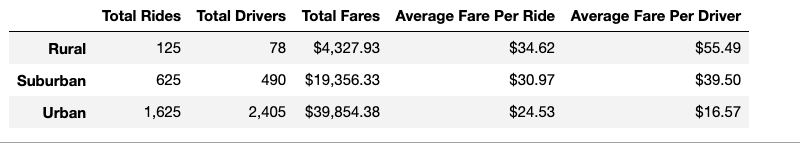
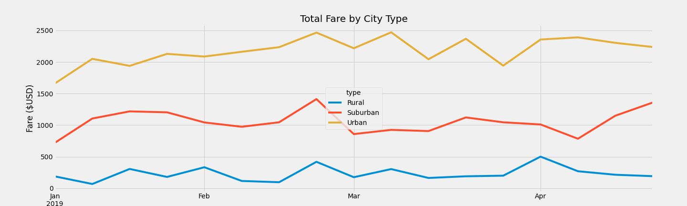

# PyBer_Analysis

# Overview of PyBer analysis

The main purpose of this analysis is to help V.Isualize by providing her a summary dataframe with the ride-sharing data by city type. Then we use matplotlib and pandas to plot a multiple-line graph that shows and comapares the total weekly fares for each city type and also a written summary of observations.

# Results

## PyBer Summary Dataframe

* As we can see in Pyber Summary Dataframe below, 
 
	- "Total Rides" for Rural city type is 5 times & 13 times lower than Suburban and Urban city types respectively.
	- "Total Drivers" for Rural city type is approximately 6 times & 30 times lower than Suburban and Urban city types respectively.
	- "Total Fares" for Rural city type is approximately 5 times & 9 times lower than SubUrban and Urban cities respectively
	- Average fare per ride in rural cities is ~$5 & ~$15 higher than Suburban and Urban cities
	- Average Fare per driver in rural cities is lot higher (~$40) compared to Urban city type and over $15 higher when compared with Suburban city type.

## Mutli-line plot

* If we look at the multi-line plot, ,

   - For Rural city type, 3rd week of Match has hit the highest fare of $500 and first week of January has seen the lowest fare of all months. 
   - Suburban city type has seen the highest fare of  $1400 during the 3rd week of February.
   - Urban city type has seen the highest fare of $2500 in both February and March months and lowest fare is seen in first week of January.
   - From all the 3 line plots, we could see that the Total fare for Rural cities is lower than Suburban & Urban city types for each of the months.
	
# Summary
## Business Recommendations for addressing disparities
1. Increasing the number of drivers in Rural & Subrban cities can reduce the Average fare per driver.
2. Reducing the cost of average fare per ride and making it more affordable in rural & suburban cities can increase the total number of rides.
3. Decrease the number of riders in Urban cities as total number of drivers is more than total rides which indicates that some drivers might not be having enough work.
